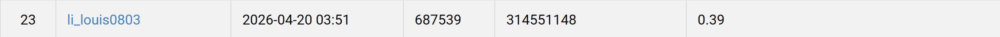

# Deformable DETR for SVHN Digit Detection

**Student ID:** 314551148  
**Name:** 李秉倫  

## Introduction
This project implements an object detection pipeline in PyTorch for digit detection using a **Deformable DETR**-style architecture. The model is designed for COCO-format bounding box annotations and supports both training and inference.

The implementation includes several practical training strategies to improve convergence and detection quality, especially for dense and small objects such as digits.

Main features:
- **Deformable DETR** with a ResNet-50 backbone
- Multi-scale feature extraction from backbone stages
- Multi-scale deformable attention encoder and decoder
- Optional **Denoising Training (DN-DETR style)** queries
- Optional **Focal Loss** for classification
- **Mosaic augmentation**
- **Multi-scale training**
- **RandomErasing** and **ColorJitter** augmentation
- **EMA (Exponential Moving Average)** model tracking
- Hungarian matching for set prediction
- Validation with:
  - loss
  - matched accuracy
  - COCO-style **mAP**
- Automatic export of:
  - checkpoints
  - training curves
  - confusion matrix
  - inference prediction JSON

This implementation is based on a single training / inference script and is suitable for homework, experiments, and ablation studies on digit detection datasets in COCO format.

---

## Project Structure
A typical dataset layout is expected to look like this:

```text
DATA_ROOT/
├── train/
│   ├── 1.jpg
│   ├── 2.jpg
│   └── ...
├── valid/
│   ├── 101.jpg
│   ├── 102.jpg
│   └── ...
├── test/
│   ├── 201.jpg
│   ├── 202.jpg
│   └── ...
├── train.json
└── valid.json
```

### Annotation Format

* `train.json` and `valid.json` should follow **COCO detection format**
* Bounding boxes should be stored as:

```json
"bbox": [x, y, width, height]
```

* Category IDs are expected to start from **1**
* The code assumes `num_classes=10` by default

---

## Environment Setup

### 1. Create a Python environment

Python **3.10+** is recommended.

```bash
python -m venv venv
source venv/bin/activate
```

On Windows:

```bash
python -m venv venv
venv\Scripts\activate
```

---

### 2. Install dependencies

```bash
pip install torch torchvision pillow tqdm matplotlib scipy numpy
```

For confusion matrix visualization:

```bash
pip install scikit-learn
```

For COCO mAP evaluation:

```bash
pip install pycocotools
```

If you want CUDA-enabled PyTorch, install the matching version from the official PyTorch installation guide.

---

## Usage

The script supports two main modes:

* `--do_train`: train the model
* `--do_infer`: run inference on the test set

You can also resume from a saved checkpoint using `--resume`.

---

## Training

Example:

```bash
python main.py \
    --do_train \
    --train_img_dir /path/to/train \
    --train_ann /path/to/train.json \
    --val_img_dir /path/to/valid \
    --val_ann /path/to/valid.json \
    --output_dir ./output \
    --num_classes 10 \
    --img_size 512 \
    --batch_size 32 \
    --epochs 80 \
    --lr 1e-4 \
    --lr_backbone 1e-5 \
    --weight_decay 1e-4 \
    --warmup_epochs 3 \
    --min_lr_ratio 0.05 \
    --num_queries 75 \
    --hidden_dim 256 \
    --enc_layers 6 \
    --dec_layers 6 \
    --dim_feedforward 1024 \
    --dropout 0.1 \
    --n_points 4 \
    --mosaic_p 0.5 \
    --multi_scale 448 480 512 544 576 608 \
    --random_erase_p 0.15 \
    --eval_every 1 \
    --val_score_thresh 0.05 \
    --nms_thresh 0.5
```

### Optional training flags

Enable denoising training:

```bash
--use_dn \
--dn_number 5 \
--label_noise_ratio 0.2 \
--box_noise_scale 0.4 \
--dn_loss_coef 1.0
```

Enable focal loss:

```bash
--use_focal \
--focal_alpha 0.25 \
--focal_gamma 2.0 \
--focal_prior 0.01
```

---

## Resume Training

```bash
python main.py \
    --do_train \
    --resume ./output/latest.pth \
    --train_img_dir /path/to/train \
    --train_ann /path/to/train.json \
    --val_img_dir /path/to/valid \
    --val_ann /path/to/valid.json \
    --output_dir ./output
```

---

## Inference

Example:

```bash
python main.py \
    --do_infer \
    --resume ./output/best.pth \
    --test_img_dir /path/to/test \
    --output_dir ./output \
    --pred_file pred.json \
    --img_size 512 \
    --score_thresh 0.3 \
    --nms_thresh 0.5
```

### Inference Output

The output file is a JSON list in COCO-style prediction format:

```json
[
  {
    "image_id": 201,
    "bbox": [x, y, w, h],
    "score": 0.95,
    "category_id": 3
  }
]
```

---

## Main Arguments

### Dataset

* `--train_img_dir`: training image folder
* `--train_ann`: training annotation JSON
* `--val_img_dir`: validation image folder
* `--val_ann`: validation annotation JSON
* `--test_img_dir`: test image folder
* `--output_dir`: directory for saving outputs
* `--pred_file`: prediction JSON filename

### Model

* `--num_classes`: number of object classes
* `--img_size`: input image size
* `--num_queries`: number of DETR object queries
* `--hidden_dim`: transformer hidden dimension
* `--nheads`: number of attention heads
* `--enc_layers`: number of encoder layers
* `--dec_layers`: number of decoder layers
* `--dim_feedforward`: FFN dimension
* `--dropout`: dropout ratio
* `--n_points`: number of deformable attention sampling points

### Training

* `--epochs`: number of training epochs
* `--batch_size`: batch size
* `--lr`: learning rate for non-backbone layers
* `--lr_backbone`: learning rate for backbone
* `--weight_decay`: AdamW weight decay
* `--clip_max_norm`: gradient clipping max norm
* `--warmup_epochs`: warmup epochs
* `--min_lr_ratio`: minimum LR ratio in cosine scheduler
* `--ema_decay`: EMA decay factor

### Augmentation

* `--mosaic_p`: mosaic augmentation probability
* `--multi_scale`: image sizes used for multi-scale training
* `--random_erase_p`: random erasing probability

### Loss / Matching

* `--cost_class`: Hungarian matching classification cost
* `--cost_bbox`: Hungarian matching bbox cost
* `--cost_giou`: Hungarian matching GIoU cost
* `--loss_ce`: classification loss weight
* `--loss_bbox`: bbox L1 loss weight
* `--loss_giou`: GIoU loss weight
* `--eos_coef`: no-object class weight
* `--use_focal`: enable focal loss
* `--focal_alpha`: focal loss alpha
* `--focal_gamma`: focal loss gamma

### Denoising Training

* `--use_dn`: enable denoising queries
* `--dn_number`: number of DN groups
* `--label_noise_ratio`: label noise ratio
* `--box_noise_scale`: box noise scale
* `--dn_loss_coef`: denoising loss coefficient

### Evaluation / Inference

* `--eval_every`: validation frequency
* `--val_score_thresh`: score threshold for validation
* `--score_thresh`: score threshold for inference
* `--nms_thresh`: NMS IoU threshold

---

## Output Files

During training, the following files may be generated in `output_dir`:

* `best.pth`
  Best checkpoint based on validation mAP

* `latest.pth`
  Latest training checkpoint

* `curves.png`
  Training / validation curves including:

  * train loss
  * val loss
  * val matched accuracy
  * val mAP

* `confusion_matrix_epX.png`
  Confusion matrix for a validation epoch

During inference:

* `pred.json`
  Detection predictions for the test set

---

## Training Strategy

This project uses several techniques to stabilize and improve training:

* **Frozen BatchNorm** in the ResNet backbone
* **AdamW** optimizer
* **Warmup + Cosine Learning Rate Scheduler**
* **Gradient Clipping**
* **EMA model evaluation**
* **Hungarian Matching**
* **Optional DN queries**
* **Optional Focal Loss**
* **Mosaic + Multi-scale augmentation**

These strategies are especially useful for small-object detection tasks such as house number recognition.

---

## Notes

* The script assumes that category labels are **1-based**
* Validation annotations are required if `--do_train` is enabled
* To compute COCO mAP correctly, install `pycocotools`
* If `pycocotools` is not installed, training can still run, but mAP evaluation may fail
* If `scikit-learn` is not installed, confusion matrix plotting will be skipped

---

## Example Training Command

```bash
python main.py --do_train --use_dn --img_size 512 \
    --batch_size 32 --epochs 80 \
    --mosaic_p 0.5 \
    --multi_scale 448 480 512 544 576 608
```

---

## Performance Snapshot



---

## Acknowledgement

This project is implemented in **PyTorch** and adopts the core idea of **Deformable DETR** for efficient object detection with multi-scale features.

