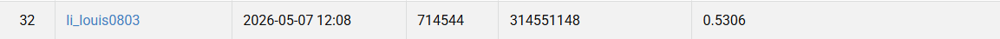

# Cascade Mask R-CNN for Medical Cell Instance Segmentation

**Student ID:** 314551148  
**Name:** 李秉倫  

## Introduction

This project implements an instance segmentation pipeline in PyTorch for colored medical cell images.  
The goal is to detect and segment four cell categories: **class1**, **class2**, **class3**, and **class4**.

Unlike simple classification or bounding-box detection, this task requires both object-level localization and pixel-level mask prediction. The dataset is also challenging because cell instances are small, dense, and visually similar across categories. In other words, the model is not just drawing pretty boxes for fun; it actually has to separate tiny overlapping objects without completely losing its mind.

Main features:

- **Cascade Mask R-CNN** style instance segmentation framework
- **ConvNeXtV2-Base** backbone using `timm`
- **Feature Pyramid Network (FPN)** with multi-scale features
- **Region Proposal Network (RPN)** with small-object anchor settings
- Three-stage **Cascade RoI Heads**
- Class-specific **Mask R-CNN mask head**
- COCO-style segmentation evaluation with **AP50**
- TIF image and mask loading
- COCO annotation conversion from instance masks
- Copy-paste augmentation
- Random crop with instance preservation
- Random resize, flip, rotation, color augmentation
- Optional Albumentations and elastic deformation
- Optional test-time augmentation
- Automatic export of:
  - checkpoints
  - training logs
  - training curves
  - confusion matrices
  - COCO-style prediction JSON

---

## Project Structure

A typical project layout is expected to look like this:

```text
PROJECT_ROOT/
├── main.py
├── dataset.py
├── README.md
├── data/
│   ├── train/
│   │   ├── 1/
│   │   │   ├── image.tif
│   │   │   ├── class1.tif
│   │   │   ├── class2.tif
│   │   │   ├── class3.tif
│   │   │   └── class4.tif
│   │   ├── 2/
│   │   │   ├── image.tif
│   │   │   └── ...
│   │   └── ...
│   ├── test/
│   │   ├── 1.tif
│   │   ├── 2.tif
│   │   └── ...
│   ├── annotations/
│   │   ├── train.json
│   │   └── val.json
│   └── test_image_name_to_ids.json
└── outputs_cascade/
    ├── best_ap50.pth
    ├── last.pth
    ├── train_log.jsonl
    ├── training_curves.png
    ├── confusion_matrix_best.png
    ├── confusion_matrix_latest.png
    ├── area_stats.json
    └── test-results.json
```

---

## Dataset Format

### Original Training Data

Each training sample should be stored in its own folder.  
Each folder should contain:

```text
sample_folder/
├── image.tif
├── class1.tif
├── class2.tif
├── class3.tif
└── class4.tif
```

The `image.tif` file is the input image.  
The `classX.tif` files are instance masks for each class.

For each class mask:

- Pixel value `0` means background
- Non-zero pixel values indicate different instances
- Different instance IDs are converted into different COCO annotations

---

## Annotation Format

The training and validation annotations are converted into **COCO instance segmentation format**.

Each annotation contains:

```json
{
  "id": 1,
  "image_id": 1,
  "category_id": 1,
  "segmentation": [[x1, y1, x2, y2, ...]],
  "bbox": [x, y, width, height],
  "area": 1234,
  "iscrowd": 0
}
```

Categories are defined as:

```json
[
  {"id": 1, "name": "class1"},
  {"id": 2, "name": "class2"},
  {"id": 3, "name": "class3"},
  {"id": 4, "name": "class4"}
]
```

The model uses `num_classes=5` because class `0` is reserved for background.

---

## Environment Setup

### 1. Create a Python environment

Python **3.10+** is recommended.

```bash
python -m venv venv
source venv/bin/activate
```

On Windows:

```bash
python -m venv venv
venv\Scripts\activate
```

---

### 2. Install dependencies

```bash
pip install torch torchvision
pip install timm opencv-python tifffile pycocotools
pip install numpy tqdm matplotlib albumentations
```

If you use CUDA, install the PyTorch version that matches your CUDA environment.  
Do not randomly install five different CUDA builds and pray. That usually ends with dependency soup.

---

## Convert Dataset to COCO Format

The file `dataset.py` converts the original `.tif` image and mask folders into COCO-style annotation files.

Example:

```bash
python -c "from dataset import tif_to_coco; tif_to_coco(train_dir='./data/train', output_json_path='./data/annotations/train.json')"
```

This will generate:

```text
data/annotations/train.json
data/annotations/val.json
```

By default, the validation split ratio is `0.2`.

You can change the split ratio and random seed:

```bash
python -c "from dataset import tif_to_coco; tif_to_coco(train_dir='./data/train', output_json_path='./data/annotations/train.json', val_ratio=0.2, seed=42)"
```

---

## Usage

The main script supports three modes:

- `--mode train`: train the model
- `--mode validate`: evaluate a checkpoint on the validation set
- `--mode inference`: run inference on the test set

---

## Training

Recommended training command:

```bash
python main.py \
    --mode train \
    --train_dir ./data/train \
    --ann_dir ./data/annotations \
    --output_dir ./outputs_cascade \
    --detector cascade_mask_rcnn \
    --backbone convnextv2_base \
    --epochs 50 \
    --batch_size 4 \
    --use_random_crop \
    --use_random_resize \
    --use_copy_paste
```

### Faster Training Command

If validation is too slow, increase the validation interval:

```bash
python main.py \
    --mode train \
    --train_dir ./data/train \
    --ann_dir ./data/annotations \
    --output_dir ./outputs_cascade \
    --detector cascade_mask_rcnn \
    --backbone convnextv2_base \
    --epochs 50 \
    --batch_size 4 \
    --val_interval 10 \
    --use_random_crop \
    --use_random_resize \
    --use_copy_paste
```

### Optional Training Flags

Enable elastic deformation:

```bash
--use_elastic
```

Enable validation loss computation:

```bash
--compute_val_loss
```

Validate also at epoch 1:

```bash
--val_at_epoch1
```

Use the fallback standard Mask R-CNN with ResNet-50:

```bash
--detector mask_rcnn \
--backbone resnet50
```

Use COCO-pretrained Mask R-CNN weights for the fallback detector:

```bash
--use_coco_pretrained
```

---

## Validation

Evaluate the best checkpoint on the validation set:

```bash
python main.py \
    --mode validate \
    --train_dir ./data/train \
    --ann_dir ./data/annotations \
    --output_dir ./outputs_cascade \
    --checkpoint ./outputs_cascade/best_ap50.pth \
    --detector cascade_mask_rcnn \
    --backbone convnextv2_base \
    --num_classes 5 \
    --crop_size 1024 \
    --score_thresh 0.05 \
    --mask_thresh 0.5 \
    --mask_nms_thresh 0.5
```

Validation outputs:

```text
outputs_cascade/confusion_matrix_validate.png
```

The validation metric is **segmentation AP50** from COCO evaluation.

---

## Inference

Run inference on the test set:

```bash
python main.py \
    --mode inference \
    --test_dir ./data/test \
    --test_ids_json ./data/test_image_name_to_ids.json \
    --output_dir ./outputs_cascade \
    --checkpoint ./outputs_cascade/best_ap50.pth \
    --detector cascade_mask_rcnn \
    --backbone convnextv2_base \
    --num_classes 5 \
    --crop_size 1024 \
    --score_thresh 0.05 \
    --mask_thresh 0.5 \
    --mask_nms_thresh 0.5 \
    --max_per_img 300
```

Enable test-time augmentation:

```bash
--use_tta
```

Enable class-wise area filtering:

```bash
--use_area_filter
```

The inference result is saved as:

```text
outputs_cascade/test-results.json
```

---

## Inference Output Format

The output file follows COCO-style instance segmentation prediction format:

```json
[
  {
    "image_id": 1,
    "category_id": 2,
    "bbox": [x, y, width, height],
    "segmentation": {
      "size": [height, width],
      "counts": "encoded_rle_string"
    },
    "score": 0.95
  }
]
```

---

## Main Arguments

### Dataset

- `--train_dir`: path to the training image folder
- `--test_dir`: path to the test image folder
- `--ann_dir`: path to the annotation folder containing `train.json` and `val.json`
- `--test_ids_json`: mapping file from test image filename to image ID
- `--output_dir`: directory for checkpoints, logs, figures, and prediction JSON
- `--checkpoint`: checkpoint path used for validation or inference

### Model

- `--num_classes`: number of classes including background, default is `5`
- `--detector`: detector type, choices are `cascade_mask_rcnn` and `mask_rcnn`
- `--backbone`: backbone type, choices are `convnextv2_base` and `resnet50`
- `--anchor_preset`: anchor configuration, choices are `default`, `area_light`, and `area`
- `--drop_path_rate`: stochastic depth rate for ConvNeXtV2
- `--rpn_nms_thresh`: NMS threshold used in the RPN

### Training

- `--epochs`: number of training epochs
- `--batch_size`: batch size
- `--num_workers`: number of dataloader workers
- `--warmup_epochs`: number of learning-rate warmup epochs
- `--val_interval`: validation frequency
- `--val_at_epoch1`: also validate at epoch 1
- `--compute_val_loss`: compute validation loss
- `--train_compute_cm`: save confusion matrix during training
- `--optimizer`: optimizer type, choices are `adamw` and `sgd`
- `--lr`: learning rate
- `--weight_decay`: weight decay
- `--grad_clip`: gradient clipping threshold
- `--use_amp`: enable mixed precision training

### Augmentation

- `--crop_size`: input crop size
- `--use_random_crop`: enable random crop with instance preservation
- `--use_random_resize`: enable random resize
- `--use_elastic`: enable elastic deformation
- `--use_copy_paste`: enable copy-paste augmentation
- `--copy_paste_prob`: copy-paste probability
- `--max_paste_objects`: maximum number of pasted objects
- `--use_albu`: enable Albumentations augmentation

### Evaluation and Post-processing

- `--score_thresh`: prediction score threshold
- `--mask_thresh`: mask binarization threshold
- `--model_score_thresh`: internal model score threshold
- `--box_nms_thresh`: bounding-box NMS threshold
- `--mask_nms_thresh`: mask-level NMS threshold
- `--max_per_img`: maximum detections per image
- `--use_tta`: enable test-time augmentation
- `--use_area_filter`: enable class-wise area filtering

---

## Output Files

During training, the following files are generated in `output_dir`:

- `best_ap50.pth`  
  Best checkpoint selected by validation AP50

- `last.pth`  
  Latest checkpoint

- `train_log.jsonl`  
  Training log containing epoch, training loss, validation loss, AP50, and learning rate

- `training_curves.png`  
  Training loss and validation AP50 curve

- `confusion_matrix_latest.png`  
  Latest validation confusion matrix during training

- `confusion_matrix_best.png`  
  Best validation confusion matrix during training

- `area_stats.json`  
  Class-wise mask area statistics for optional area filtering

During validation:

- `confusion_matrix_validate.png`  
  Confusion matrix generated from the selected checkpoint

During inference:

- `test-results.json`  
  COCO-style test prediction file

---

## Training Strategy

This implementation uses several strategies to improve training stability and segmentation quality:

- **ConvNeXtV2-Base backbone** for stronger hierarchical visual features
- **FPN** for multi-scale feature fusion
- **Small-object anchor preset** for compact cell instances
- **Three-stage Cascade RoI Heads** with IoU thresholds `0.5`, `0.6`, and `0.7`
- **Mask R-CNN mask branch** for class-specific instance masks
- **AdamW optimizer**
- **Warmup + cosine learning-rate scheduler**
- **Backbone learning rate = 0.1 × main learning rate**
- **Gradient clipping**
- **Mixed precision training**
- **Copy-paste augmentation**
- **Random crop with instance preservation**
- **Random resize and color augmentation**
- **Mask-level NMS and connected-component filtering**

These techniques are useful for dense medical cell segmentation because small objects are easy to miss and false positives are annoyingly easy to create.

---

## Performance Snapshot




---


## Acknowledgement

This project is implemented in **PyTorch** and follows the instance segmentation design of **Mask R-CNN** and **Cascade R-CNN**, with a ConvNeXtV2-FPN backbone for stronger multi-scale visual representation.
